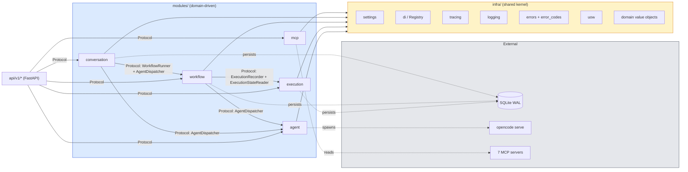
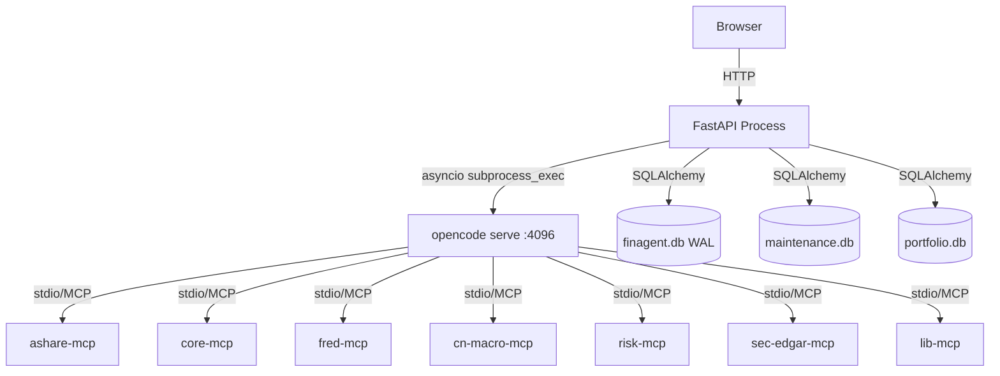

# 目标架构设计文档

> 版本: **v2.1 (target)** · 日期: 2026-06-18 · 状态: 待评审
> 范围: 后端 Python 服务 + API 契约 + 模块边界;前端与 MCP 服务本轮不在改动范围
>
> **修订日志**
> | 版本 | 日期 | 修订要点 |
> |---|---|---|
> | v2.0 | 2026-06-18 | 初版设计（10 节 + 验收清单） |
> | v2.1 | 2026-06-18 | 新增 §11「并行与状态迁移强制规则」：① 并行 trace_id 必须显式参数传递（ContextVar 在 asyncio.gather 跨 Task 时不可靠）；② 执行器状态迁移必须产出 diff 校验，禁止机械搬运成员变量。新增 Do Not #18、#19，验收清单 5 条新检查 |

---

## 0. 设计原则（硬约束汇总）

| # | 原则 | 反例（当前代码） |
|---|---|---|
| P1 | 模块 = 领域边界,内部分 4 层 (domain/service/repo/protocol) | framework/ 按技术分层,跨域互相 import |
| P2 | 对外只暴露 Protocol;实现类禁止被其他模块 import | 4 处 import `_resolve_agent_name` |
| P3 | 无循环依赖;依赖图必须可拓扑排序 | workflow ↔ execution 双向耦合 |
| P4 | 契约优先:Protocol / 异常 / 状态机 / API 信封 = 合同,代码 = 实现 | 字符串 `"HTTP 5"` 当分类器 |
| P5 | 配置单一来源:环境/路径/端口/超时/重试 → settings.py | 端口 4096 写死,常量 3 与代码内 3 重复 |
| P6 | DI 单一入口:register_singleton(Protocol, Factory) | 三套 register + _SERVICE_MAP + 全局 _container |
| P7 | 事务边界 = UoW;执行器无 Session | AgentNodeExecutor 自己 commit |
| P8 | 重试只一层 (workflow 层),执行器内禁止 | 双层重试叠加 |
| P9 | trace_id 贯穿:HTTP → Service → subprocess → DB | 当前 trace 缺失 |
| P10 | 禁止清单见 §9 | 见 §9 |

---

## 1. 模块依赖图（Mermaid）

### 1.1 模块级依赖图（Protocol 视角,无环）



**拓扑序**: `AGT` ∥ `EXE` ∥ `MCP_M` → `WF` → `CONV` → `API`

> **为什么没有 EXE → WF 反向依赖?**
> 重试编排需要 DAG 拓扑信息,这部分逻辑放在 `workflow/service/retry_service.py`(它本来就是 DAG-aware)。`execution` 模块只管状态机与持久化,不感知 DAG。任何需要 DAG 的执行侧操作都通过 Protocol 由 workflow 暴露。

### 1.2 进程拓扑



每个子进程在启动时接收环境变量 `FIN_AGENT_TRACE_ID`,在自身日志中打印。

---

## 2. 目录结构

```
src/main/
├── api/ # HTTP 入口（FastAPI routers）
│ ├── __init__.py
│ ├── deps.py # Depends() 工厂 + get_registry()
│ ├── envelope.py # ApiResponse / ErrorBody
│ └── v1/
│ ├── workflows.py
│ ├── executions.py
│ ├── agents.py
│ ├── conversations.py
│ └── mcp.py
│
├── infra/ # 基础设施 + 共享内核
│ ├── __init__.py
│ ├── settings.py # pydantic-settings (env_prefix=FIN_AGENT_)
│ ├── constants.py # 业务不变量（仅硬上限/枚举值）
│ ├── db.py # SQLAlchemy engine + SessionLocal + PRAGMA
│ ├── di.py # Registry（单一 register_singleton）
│ ├── uow.py # UnitOfWork（事务边界）
│ ├── errors.py # FinAgentError / BizError / SystemError / InfraError
│ ├── error_codes.py # ErrorCode 枚举
│ ├── api_envelope.py # {code, message, data, trace_id}
│ ├── tracing.py # trace_id contextvar + middleware
│ ├── logging.py # 结构化 JSON logger
│ ├── auth.py # API key + localhost 策略
│ ├── event_bus.py # 进程内事件（启动/停止/告警）
│ ├── domain.py # 共享值对象: WorkflowId/ExecutionId/NodeId/
│ │ # SessionId/ConversationId/AgentReference/
│ │ # TraceId/RetryPolicy
│ └── retry.py # retry_on_failure 装饰器（仅 workflow 层用）
│
└── modules/ # 领域模块（bounded context）
    │
    ├── mcp/
    │ ├── domain/
    │ │ ├── tool.py # Tool / ToolServer / ToolCategory 值对象
    │ │ └── catalog.py # 内存目录（不可变快照）
    │ ├── repo/
    │ │ └── manifest_loader.py # 解析 .opencode/opencode.json
    │ ├── service/
    │ │ └── tool_query_service.py # 列表/筛选/按 agent 白名单
    │ └── protocol.py # ToolCatalog Protocol（对外唯一）
    │
    ├── agent/
    │ ├── domain/
    │ │ ├── agent_definition.py # AgentDefinition (从 .md 文件解析)
    │ │ └── session.py # Session aggregate
    │ ├── repo/
    │ │ └── agent_definition_repo.py # 读 .opencode/agents/*.md
    │ ├── service/
    │ │ ├── agent_dispatcher.py # 高层调度（含会话复用/超时/重试）
    │ │ └── session_manager.py # conversation_id ↔ session_id
    │ ├── adapter/
    │ │ └── serve_backend.py # 实现 AgentBackend Protocol（仅本模块内）
    │ └── protocol.py # AgentDispatcher / AgentBackend / SessionManager
    │
    ├── execution/
    │ ├── domain/
    │ │ ├── execution.py # WorkflowExecution 聚合根
    │ │ ├── execution_node.py # ExecutionNode + ExecutionStatus 枚举 + 迁移表
    │ │ └── state_machine.py # validate_transition()
    │ ├── repo/
    │ │ ├── orm.py # SQLAlchemy ORM（仅本模块）
    │ │ └── execution_repo.py
    │ ├── service/
    │ │ └── execution_service.py # 状态机执行 + 持久化（无 DAG 知识）
    │ └── protocol.py # ExecutionRecorder / ExecutionStateReader
    │
    ├── workflow/
    │ ├── domain/
    │ │ ├── workflow.py # Workflow 聚合根
    │ │ ├── node.py # Node + NodeType 枚举
    │ │ ├── edge.py
    │ │ └── dag.py # 拓扑排序 / 并行分支识别 / 前驱计算
    │ ├── repo/
    │ │ ├── orm.py # SQLAlchemy ORM（仅本模块）
    │ │ └── workflow_repo.py
    │ ├── service/
    │ │ ├── workflow_query_service.py # CRUD + 列表 + 统计
    │ │ ├── workflow_runner.py # DAG 编排（替代原 WorkflowEngine）
    │ │ ├── retry_service.py # DAG-aware 重试 + 熔断
    │ │ ├── scheduler.py # APScheduler 包装
    │ │ └── prompt_builder.py # 模板渲染
    │ ├── executor/
    │ │ ├── base.py # NodeExecutor Protocol + NodeContext
    │ │ ├── agent_executor.py
    │ │ ├── debate_executor.py
    │ │ ├── input_executor.py
    │ │ ├── output_executor.py
    │ │ └── registry.py # typed factory（无单例缓存）
    │ └── protocol.py # WorkflowRunner / WorkflowReader /
    │ # NodeExecutor / NodeContext
    │
    └── conversation/
        ├── domain/
        │ ├── conversation.py
        │ └── message.py
        ├── repo/
        │ ├── orm.py
        │ └── conversation_repo.py
        ├── service/
        │ └── conversation_service.py
        └── protocol.py # ConversationService Protocol
```

---

## 3. 契约层（最高优先级）

### 3.1 共享值对象（`infra/domain.py`）

```python
# 用 NewType 表达 ID；用 dataclass(frozen=True) 表达值对象
TraceId = NewType("TraceId", str)
WorkflowId = NewType("WorkflowId", str)
ExecutionId = NewType("ExecutionId", str)
NodeId = NewType("NodeId", str)
SessionId = NewType("SessionId", str)
ConversationId = NewType("ConversationId", str)

@dataclass(frozen=True)
class AgentReference:
    """Resolved agent identifier — replaces _resolve_agent_name()."""
    name: str # e.g. "macro-scout"
    definition_path: Path | None # .opencode/agents/<name>.md

    @classmethod
    def from_node(cls, node: dict) -> "AgentReference":
        """唯一允许解析 DTO 的地方；调用方传 Node 进来。"""
        name = node.get("agent") or node.get("data", {}).get("agentType") \
               or node.get("data", {}).get("label", "")
        if not name:
            raise BizError(ErrorCode.AGENT_NOT_SPECIFIED, "node has no agent")
        return cls(name=name, definition_path=Path(f".opencode/agents/{name}.md"))

@dataclass(frozen=True)
class RetryPolicy:
    max_attempts: int = 3
    base_delay: float = 1.0
    backoff: float = 2.0
    circuit_breaker_threshold: int = 5
```

### 3.2 异常层级（`infra/errors.py`）

```python
class FinAgentError(Exception):
    """根异常。所有 raise 必须落在这棵树上。"""
    code: ClassVar[ErrorCode]
    http_status: ClassVar[int]
    payload: dict[str, Any]

    def __init__(self, message: str, *, details: dict | None = None,
                 cause: Exception | None = None) -> None:
        super().__init__(message)
        self.message = message
        self.details = details or {}
        self.__cause__ = cause

    def to_envelope(self, trace_id: TraceId) -> dict:
        return {
            "code": int(self.code),
            "message": self.message,
            "data": self.details or None,
            "trace_id": str(trace_id),
        }

class BizError(FinAgentError):
    """业务规则违反。调用方可修正后重试。HTTP 4xx。"""

class SystemError(FinAgentError):
    """内部 bug。HTTP 5xx + 报警。"""

class InfraError(FinAgentError):
    """上游/下游故障（DB/网络/subprocess/超时）。HTTP 5xx 或 504。"""
```

**具体异常族**（每个错误码必须有一个异常类，**禁止字符串匹配**）：

| 异常类 | 基类 | ErrorCode | HTTP |
|---|---|---|---|
| `WorkflowNotFoundError` | BizError | `WORKFLOW_NOT_FOUND` | 404 |
| `ExecutionNotFoundError` | BizError | `EXECUTION_NOT_FOUND` | 404 |
| `NodeNotFoundError` | BizError | `NODE_NOT_FOUND` | 404 |
| `AgentNotFoundError` | BizError | `AGENT_NOT_DEFINED` | 422 |
| `ValidationError` | BizError | `VALIDATION_FAILED` | 422 |
| `InvalidStateTransitionError` | SystemError | `INVALID_STATE_TRANSITION` | 500 |
| `ConfigError` | SystemError | `CONFIG_INCONSISTENT` | 500 |
| `DatabaseError` | InfraError | `DATABASE_FAILURE` | 500 |
| `AgentTimeoutError` | InfraError | `AGENT_TIMEOUT` | 504 |
| `AgentHttp5xxError` | InfraError | `AGENT_UPSTREAM_5XX` | 502 |
| `OpencodeUnavailableError` | InfraError | `OPENCODE_UNAVAILABLE` | 503 |
| `McpServerError` | InfraError | `MCP_SERVER_FAILURE` | 502 |

### 3.3 错误码（`infra/error_codes.py`）

```python
class ErrorCode(IntEnum):
    SUCCESS = 0
    # 1xxx: BizError
    WORKFLOW_NOT_FOUND = 1001
    EXECUTION_NOT_FOUND = 1002
    NODE_NOT_FOUND = 1003
    AGENT_NOT_DEFINED = 1004
    AGENT_NOT_SPECIFIED = 1005
    VALIDATION_FAILED = 1100
    # 2xxx: SystemError
    INVALID_STATE_TRANSITION = 2001
    CONFIG_INCONSISTENT = 2002
    PROTOCOL_VIOLATION = 2003
    # 3xxx: InfraError
    DATABASE_FAILURE = 3001
    AGENT_TIMEOUT = 3002
    AGENT_UPSTREAM_5XX = 3003
    OPENCODE_UNAVAILABLE = 3004
    MCP_SERVER_FAILURE = 3005
    TRACE_LOST = 3006
```

### 3.4 API 信封（`infra/api_envelope.py`）

```python
@dataclass(frozen=True)
class ApiResponse:
    code: ErrorCode # 0 = SUCCESS
    message: str
    data: Any | None
    trace_id: TraceId

    def to_dict(self) -> dict:
        return {
            "code": int(self.code),
            "message": self.message,
            "data": self.data,
            "trace_id": str(self.trace_id),
        }
```

FastAPI 全局异常处理器把 `FinAgentError` → `ApiResponse(code=非零)` → `JSONResponse`（含 `X-Trace-Id` header）。

### 3.5 ExecutionNode 状态机（`modules/execution/domain/execution_node.py`）

```python
class ExecutionStatus(str, Enum):
    PENDING = "pending"
    RUNNING = "running"
    COMPLETED = "completed"
    FAILED = "failed"
    SKIPPED = "skipped"
    CLEANED_UP = "cleaned_up"

# 合法迁移表（任何不在表内的迁移 → InvalidStateTransitionError）
LEGAL_TRANSITIONS: dict[ExecutionStatus, frozenset[ExecutionStatus]] = {
    ExecutionStatus.PENDING: frozenset({ExecutionStatus.RUNNING,
                                           ExecutionStatus.SKIPPED}),
    ExecutionStatus.RUNNING: frozenset({ExecutionStatus.COMPLETED,
                                           ExecutionStatus.FAILED}),
    ExecutionStatus.COMPLETED: frozenset({ExecutionStatus.CLEANED_UP}),
    ExecutionStatus.FAILED: frozenset({ExecutionStatus.PENDING, # retry
                                           ExecutionStatus.CLEANED_UP}),
    ExecutionStatus.SKIPPED: frozenset(), # terminal
    ExecutionStatus.CLEANED_UP: frozenset(), # terminal
}

def transition(current: ExecutionStatus, target: ExecutionStatus) -> None:
    if target not in LEGAL_TRANSITIONS[current]:
        raise InvalidStateTransitionError(
            f"illegal: {current.value} -> {target.value}",
            details={"from": current.value, "to": target.value},
        )
```

### 3.6 各模块 Protocol 定义

> **所有 Protocol 集中在每个模块根目录的 `protocol.py`,这是该模块对外的唯一公开文件。**

#### 3.6.1 `modules/agent/protocol.py`

```python
class DispatchResult(TypedDict):
    result: Any
    session_id: SessionId
    raw: str

class AgentDispatcher(Protocol):
    """高层调度：会话复用、超时、结构化错误分类。"""

    async def dispatch(
        self,
        agent: AgentReference,
        prompt: str,
        *,
        timeout: float | None = None, # None → settings.NODE_TIMEOUT_SECONDS
        session_id: SessionId | None = None,
        reuse_session: bool = False,
        trace_id: TraceId,
    ) -> DispatchResult:
        """Raises: AgentTimeoutError, AgentHttp5xxError, OpencodeUnavailableError,
                   McpServerError, ValidationError"""

    async def dispatch_parallel(
        self,
        agents: list[AgentReference],
        prompt: str,
        *,
        timeout: float | None = None,
        trace_id: TraceId,
    ) -> tuple[list[DispatchResult], list[SessionId]]: ...

class AgentBackend(Protocol):
    """底层 opencode HTTP 传输。仅 AgentDispatcher 使用，不向外暴露。"""

    async def create_session(self, agent: AgentReference,
                             trace_id: TraceId) -> SessionId: ...
    async def send_message(self, session_id: SessionId, text: str,
                          agent: AgentReference | None,
                          trace_id: TraceId) -> None: ...
    async def wait_for_completion(self, session_id: SessionId, *,
                                  timeout: float, after_count: int) -> str: ...
    async def abort_session(self, session_id: SessionId) -> None: ...
    async def cleanup_sessions(self, ids: list[SessionId]
                               ) -> dict[SessionId, str]: ...
    async def close(self) -> None: ...

class SessionManager(Protocol):
    async def bind(self, conversation_id: ConversationId,
                   session_id: SessionId) -> None: ...
    async def lookup(self, conversation_id: ConversationId) -> SessionId | None: ...
```

#### 3.6.2 `modules/execution/protocol.py`

```python
class ExecutionRecorder(Protocol):
    """写入侧 — 由 WorkflowRunner 调用。"""

    async def create_execution(self, workflow_id: WorkflowId,
                               params: dict, trace_id: TraceId) -> ExecutionId: ...
    async def record_node_started(self, execution_id: ExecutionId,
                                  node_id: NodeId, trace_id: TraceId) -> None: ...
    async def record_node_completed(self, execution_id: ExecutionId,
                                    node_id: NodeId, output: dict,
                                    session_id: SessionId | None,
                                    trace_id: TraceId) -> None: ...
    async def record_node_failed(self, execution_id: ExecutionId,
                                 node_id: NodeId, error: FinAgentError,
                                 trace_id: TraceId) -> None: ...
    async def record_node_skipped(self, execution_id: ExecutionId,
                                  node_id: NodeId, trace_id: TraceId) -> None: ...
    async def mark_execution(self, execution_id: ExecutionId,
                             status: ExecutionStatus,
                             trace_id: TraceId) -> None: ...
    async def mark_downstream_skipped(self, execution_id: ExecutionId,
                                      failed_node_id: NodeId,
                                      trace_id: TraceId) -> list[NodeId]: ...

class ExecutionStateReader(Protocol):
    """读取侧 — 由 workflow.retry_service 和 API 查询端调用。"""

    def get_execution(self, execution_id: ExecutionId) -> WorkflowExecution | None: ...
    def get_execution_nodes(self, execution_id: ExecutionId) -> list[ExecutionNode]: ...
    def get_failed_nodes(self, execution_id: ExecutionId) -> list[ExecutionNode]: ...
    def get_node(self, execution_id: ExecutionId,
                 node_id: NodeId) -> ExecutionNode | None: ...
    def list_executions(self, workflow_id: WorkflowId | None = None,
                        *, limit: int, offset: int) -> list[WorkflowExecution]: ...

class CircuitBreaker(Protocol):
    """由 workflow.retry_service 实现并调用，execution 不感知。"""
```

#### 3.6.3 `modules/workflow/protocol.py`

```python
class NodeContext(TypedDict):
    """执行器看到的上下文。绝对禁止包含 db/session/repo。"""
    node: Node
    execution_id: ExecutionId
    predecessor_ids: list[NodeId]
    params: dict[str, Any]
    results: dict[NodeId, "NodeResult"] # 只读快照；写权在 WorkflowRunner
    edges: list[Edge]
    trace_id: TraceId
    chain_sessions: Mapping[NodeId, SessionId] # 只读快照；写权在 WorkflowRunner

class NodeResult(TypedDict):
    output: Any
    session_id: SessionId | None
    extra_data: dict[str, Any] # 用于 debate 多 session_id 等

class NodeExecutor(Protocol):
    """无状态。每次调用都是新实例（registry 不缓存）。
    禁止持有任何跨调用持久化的成员变量。
    """
    async def execute(self, ctx: NodeContext) -> NodeResult: ...

class NodeExecutorFactory(Protocol):
    """如何根据 NodeType 拿到 executor。无缓存、无单例。"""
    def create(self, node_type: NodeType, *,
               dispatcher: AgentDispatcher,
               execution_recorder: ExecutionRecorder,
               trace_id: TraceId) -> NodeExecutor: ...

class WorkflowRunner(Protocol):
    """DAG 编排入口 — 替代原 WorkflowEngine。"""
    async def run(self, workflow_id: WorkflowId, params: dict,
                  *, execution_id: ExecutionId | None = None,
                  trace_id: TraceId) -> ExecutionSummary: ...

class WorkflowReader(Protocol):
    def get(self, workflow_id: WorkflowId) -> Workflow | None: ...
    def list(self, *, limit: int, offset: int) -> list[Workflow]: ...

class RetryService(Protocol):
    async def retry_node(self, execution_id: ExecutionId,
                         node_id: NodeId, trace_id: TraceId) -> RetryResult: ...
    async def retry_workflow(self, workflow_id: WorkflowId,
                             *, from_node_id: NodeId | None,
                             trace_id: TraceId) -> RetryResult: ...
```

#### 3.6.4 `modules/mcp/protocol.py`

```python
class ToolCatalog(Protocol):
    def list_tools(self, *, server: str | None = None,
                   category: str | None = None) -> list[ToolDescriptor]: ...
    def list_servers(self) -> list[ToolServerDescriptor]: ...
    def list_allowed_for_agent(self, agent: AgentReference) -> list[ToolDescriptor]: ...
    def get_tool(self, server: str, name: str) -> ToolDescriptor | None: ...
    def reload(self) -> None: ... # 重读 opencode.json
```

#### 3.6.5 `modules/conversation/protocol.py`

```python
class ConversationService(Protocol):
    async def create(self, agent: AgentReference,
                     title: str | None) -> Conversation: ...
    async def list(self, *, limit: int, offset: int) -> list[Conversation]: ...
    async def get(self, conversation_id: ConversationId) -> Conversation | None: ...
    async def append_message(self, conversation_id: ConversationId,
                             role: MessageRole, content: str) -> Message: ...
    async def get_messages(self, conversation_id: ConversationId, *,
                           limit: int, offset: int) -> list[Message]: ...
```

---

## 4. 事务与并发

### 4.1 UnitOfWork（`infra/uow.py`）

```python
class UnitOfWork(Protocol):
    """事务边界。每个并行节点开一个 UoW,串行节点复用。"""
    async def __aenter__(self) -> "UnitOfWork": ...
    async def __aexit__(self, exc_type, exc, tb) -> None: ...
    async def commit(self) -> None: ...
    async def rollback(self) -> None: ...

# 工厂:
class UoWFactory(Protocol):
    def begin(self) -> UnitOfWork: ... # 开启新事务
    def join(self, existing: Session) -> UnitOfWork: ... # 复用传入 Session

# WorkflowRunner 使用模式:
async with uow_factory.begin() as uow:
    rec = uow.execution_recorder # 与 uow 同生命周期的 ExecutionRecorder
    rec.record_node_started(...)
    result = await executor.execute(ctx) # 执行器不持有 uow/rec
    rec.record_node_completed(..., result)
    # 自动 commit（无异常时）
```

**强约束**:
- `NodeExecutor.execute(ctx)` 的 `ctx` **不包含 `db` / `uow` / `repo` 任何一个引用**。
- 执行器只读 `ctx["results"]`,写 `NodeResult`;**所有持久化由 WorkflowRunner 在拿到 NodeResult 之后通过 ExecutionRecorder 完成**。
- 执行器内**禁止** `await repo.x()` / `session.commit()` / `db.rollback()`。

**执行状态归属（执行器无状态的另一半）**:

| 状态变量 | 旧位置(违规) | 新位置(强制) | 谁负责写 |
|---|---|---|---|
| `_results: dict[node_id, NodeResult]` | `AgentNodeExecutor.__init__` | `WorkflowRunner._results`(本次执行的本地) | WorkflowRunner 写,作为 ctx 只读快照传给执行器 |
| `_failed_nodes: set[node_id]` | `AgentNodeExecutor` | `WorkflowRunner._failed_nodes` | WorkflowRunner 写;通过 `mark_downstream_skipped` 落库 |
| `_skipped_nodes: set[node_id]` | `AgentNodeExecutor` | `WorkflowRunner._skipped_nodes` | 同上 |
| `_chain_sessions: dict[node_id, session_id]` | `AgentNodeExecutor.__init__` | `WorkflowRunner._chain_sessions` | WorkflowRunner 写;作为 `ctx["chain_sessions"]` 只读快照给执行器用于串行链判断 |
| `_db: Session` | `AgentNodeExecutor.__init__` | 不持有 | 见 §4.1 UoW 边界 |
| `dispatcher: AgentDispatcher` | `AgentNodeExecutor.__init__` | 通过 `NodeExecutorFactory.create(..., dispatcher=...)` 注入(无持久化) | 每次新建 executor 时由工厂注入 |

**执行器构造禁止清单**:
```python
# ❌ 禁止 — 执行器构造函数出现任何 dict/set/list 等可变容器字段
class AgentNodeExecutor:
    def __init__(self, dispatcher: AgentDispatcher):
        self.dispatcher = dispatcher # OK: 不可变引用
        # self._results = {} ❌ 禁止
        # self._chain_sessions = {} ❌ 禁止
        # self._failed_nodes = set() ❌ 禁止
```

Phase 3 实施时必须对每个 executor 类做 **状态字段审计 diff**（详见 §8.1 Phase 3 第 3 步）。

### 4.2 重试 — 单层

- **唯一重试源**:`modules/workflow/service/retry_service.py`(`RetryService` Protocol 实现)
- 使用 `infra/retry.py::retry_on_failure(policy: RetryPolicy)` 装饰器
- **删除** `agent_executor.py` 中的内层重试(原 L128-152)
- AgentDispatcher.dispatch 抛出**结构化** `AgentHttp5xxError(status_code, body)`,由 RetryService 判断是否重试(状态码在 5xx 范围内)
- 熔断器状态由 RetryService 内部维护(per execution_id)

### 4.3 SQLite 并行写策略

**默认配置**（`infra/db.py::configure_sqlite`）:

```python
PRAGMA journal_mode = WAL; # 读写并发
PRAGMA busy_timeout = 30000; # 30s,超出后抛 DatabaseError
PRAGMA synchronous = NORMAL; # WAL 下安全
PRAGMA foreign_keys = ON;
```

**Session 策略**:
- 串行分支:WorkflowRunner 持一个 UoW,所有节点共享一个 Session
- 并行分支(`asyncio.gather`):每个并行节点开独立 UoW(独立 Session),SQLAlchemy 连接池上限 = `settings.DB_POOL_SIZE`(默认 5)
- 短事务:每个节点执行结束立即 commit,不跨节点持有锁

**PostgreSQL 迁移判断标准**(文档化,不在本轮实施):

| 触发条件 | 阈值 | 决策 |
|---|---|---|
| 并行节点平均并发 | > 10 | 迁移 PG |
| 数据库大小 | > 1 GB | 迁移 PG |
| 多 worker 部署 (`uvicorn --workers N`, N>1) | 启用 | 迁移 PG |
| 需 point-in-time 恢复 | 是 | 迁移 PG |
| 写入 QPS | > 200 | 评估 PG |

---

## 5. 配置管理

### 5.1 `infra/settings.py`（pydantic-settings）

```python
class Settings(BaseSettings):
    # ── HTTP ──
    API_HOST: str = "127.0.0.1"
    API_PORT: int = 8000

    # ── Database ──
    DATABASE_URL: str = "sqlite:///./data/finagent.db"
    DB_POOL_SIZE: int = 5
    DB_BUSY_TIMEOUT_MS: int = 30000
    DB_JOURNAL_MODE: Literal["WAL", "DELETE"] = "WAL"

    # ── Opencode ──
    OPENCODE_BIN: str = "" # 空 → 启动时自动探测
    OPENCODE_SERVE_HOST: str = "127.0.0.1"
    OPENCODE_SERVE_PORT: int = 4096
    OPENCODE_AGENTS_DIR: Path = Path(".opencode/agents")
    OPENCODE_MCP_CONFIG: Path = Path(".opencode/opencode.json")

    # ── Workflow ──
    NODE_TIMEOUT_SECONDS: float = 600.0
    MAX_PARALLEL_NODES: int = 5
    POLL_INTERVAL_SECONDS: float = 0.5
    PREDECESSOR_WAIT_TIMEOUT_SECONDS: float = 600.0

    # ── Retry ──
    MAX_AGENT_RETRIES: int = 3
    RETRY_BASE_DELAY_SECONDS: float = 1.0
    RETRY_BACKOFF_FACTOR: float = 2.0
    CIRCUIT_BREAKER_THRESHOLD: int = 5

    # ── Tracing ──
    TRACE_ID_HEADER: str = "X-Trace-Id"
    TRACE_ID_ENV_VAR: str = "FIN_AGENT_TRACE_ID"

    # ── Auth ──
    API_KEY: str = ""
    AUTH_SKIP_LOCALHOST: bool = False

    # ── Logging ──
    LOG_LEVEL: Literal["DEBUG","INFO","WARNING","ERROR"] = "INFO"
    LOG_FORMAT: Literal["json", "console"] = "json"

    class Config:
        env_prefix = "FIN_AGENT_"

    @property
    def opencode_serve_url(self) -> str:
        return f"http://{self.OPENCODE_SERVE_HOST}:{self.OPENCODE_SERVE_PORT}"

    def validate(self) -> None:
        """启动时一致性校验。任何错误抛 ConfigError。"""
        if self.OPENCODE_SERVE_PORT == self.API_PORT:
            raise ConfigError("OPENCODE_SERVE_PORT must differ from API_PORT")
        if not self.OPENCODE_AGENTS_DIR.is_dir():
            raise ConfigError(f"OPENCODE_AGENTS_DIR not found: {self.OPENCODE_AGENTS_DIR}")
        if not self.OPENCODE_MCP_CONFIG.is_file():
            raise ConfigError(f"OPENCODE_MCP_CONFIG not found: {self.OPENCODE_MCP_CONFIG}")
        if self.DB_POOL_SIZE < self.MAX_PARALLEL_NODES:
            raise ConfigError("DB_POOL_SIZE must be >= MAX_PARALLEL_NODES")
```

### 5.2 `infra/constants.py`（**只放真正的业务不变量**）

```python
# 业务上限（不是运维配置 —— 改它需要业务评审）
MAX_NODES_PER_WORKFLOW: int = 20

# 状态机迁移表（设计上唯一来源，与 ExecutionStatus 在同一模块）
# 注:迁移表已在 modules/execution/domain/execution_node.py 内,不在此处重复

# 业务规则（语义常量,不是配置）
SCHEDULER_MAX_INSTANCES: int = 1
MAINTENANCE_RETENTION_DAYS: int = 30

# 时间格式（用于 API 序列化）
ISO_8601_UTC = "%Y-%m-%dT%H:%M:%S.%fZ"
```

**判定标准**:如果你能在 `.env` 或 `docker-compose.yml` 里改它 → 放 `settings.py`;如果改它需要业务评审 / 数据库迁移 → 放 `constants.py`。

### 5.3 启动校验

`main.py` 在 `Registry` 初始化之后、`app = FastAPI()` 之前调用:

```python
settings = Settings()
settings.validate()
settings.OPENCODE_BIN = settings.OPENCODE_BIN or _detect_opencode_bin(settings.OPENCODE_AGENTS_DIR.parent.parent / "agents" / "opencode")
```

任何 `ConfigError` → 进程退出码 78(`EX_CONFIG`),写 stderr 日志,不发邮件不发 HTTP。

---

## 6. DI 改造

### 6.1 `infra/di.py` — 单一注册入口

```python
class RegistryError(FinAgentError): ...

class Registry:
    """唯一 DI 入口。无全局变量、无 _SERVICE_MAP、无属性反射。"""

    def __init__(self) -> None:
        self._factories: dict[type, Callable[["Registry"], Any]] = {}
        self._instances: dict[type, Any] = {}
        self._lock = asyncio.Lock()

    def register_singleton(
        self, protocol: type, factory: Callable[["Registry"], Any]
    ) -> None:
        if not isinstance(protocol, type):
            raise RegistryError(f"protocol must be a type, got {protocol!r}")
        if protocol in self._factories:
            raise RegistryError(f"{protocol.__name__} already registered")
        self._factories[protocol] = factory

    async def resolve(self, protocol: type) -> Any:
        async with self._lock:
            if protocol in self._instances:
                return self._instances[protocol]
            if protocol not in self._factories:
                raise RegistryError(f"{protocol.__name__} not registered")
            instance = self._factories[protocol](self)
            self._instances[protocol] = instance
            return instance

    async def shutdown(self) -> None:
        for inst in self._instances.values():
            close = getattr(inst, "close", None)
            if callable(close):
                try: await close()
                except Exception: pass
        self._instances.clear()
```

### 6.2 FastAPI 集成

```python
# api/deps.py
from fastapi import Request
async def get_registry(request: Request) -> Registry:
    return request.app.state.registry

def service_dep(protocol: type):
    async def _dep(reg: Registry = Depends(get_registry)) -> Any:
        return await reg.resolve(protocol)
    return _dep

# 用法:
# @router.get("/workflows")
# async def list_workflows(
# svc: WorkflowReader = Depends(service_dep(WorkflowReader)),
# ): ...
```

### 6.3 启动装配（`main.py`）

```python
async def build_registry(settings: Settings) -> Registry:
    reg = Registry()
    db = create_engine(settings)

    reg.register_singleton(Settings, lambda r: settings)
    reg.register_singleton(Registry, lambda r: r) # 自引用,允许跨解析

    # infra
    reg.register_singleton(UnitOfWorkFactory, lambda r: SqlAlchemyUoWFactory(db, settings))

    # mcp
    reg.register_singleton(ToolCatalog, lambda r: OpencodeJsonToolCatalog(settings.OPENCODE_MCP_CONFIG))

    # agent
    reg.register_singleton(AgentBackend, lambda r: ServeBackend(
        settings.opencode_serve_url, settings.OPENCODE_BIN, settings))
    reg.register_singleton(AgentDispatcher, lambda r: DefaultAgentDispatcher(
        backend=r.resolve(AgentBackend), tracer=r.resolve(Tracer), settings=r.resolve(Settings)))
    reg.register_singleton(SessionManager, lambda r: InMemorySessionManager())

    # execution
    reg.register_singleton(ExecutionRecorder, lambda r: SqlAlchemyExecutionRecorder(
        uow_factory=r.resolve(UnitOfWorkFactory)))
    reg.register_singleton(ExecutionStateReader, lambda r: SqlAlchemyExecutionReader(db))

    # workflow
    reg.register_singleton(WorkflowReader, lambda r: SqlAlchemyWorkflowReader(db))
    reg.register_singleton(WorkflowRunner, lambda r: DefaultWorkflowRunner(
        reader=r.resolve(WorkflowReader),
        recorder=r.resolve(ExecutionRecorder),
        dispatcher=r.resolve(AgentDispatcher),
        executor_factory=DefaultExecutorFactory(),
        retry_service=r.resolve(RetryService),
        uow_factory=r.resolve(UnitOfWorkFactory),
        settings=r.resolve(Settings)))
    reg.register_singleton(RetryService, lambda r: DefaultRetryService(
        reader=r.resolve(ExecutionStateReader),
        recorder=r.resolve(ExecutionRecorder),
        dispatcher=r.resolve(AgentDispatcher),
        settings=r.resolve(Settings)))

    # conversation
    reg.register_singleton(ConversationService, lambda r: DefaultConversationService(
        reader=r.resolve(...), recorder=..., uow_factory=r.resolve(UnitOfWorkFactory)))

    return reg
```

### 6.4 测试覆盖

```python
# tests/conftest.py
@pytest.fixture
def app_with_overrides():
    app = build_app()
    mock_dispatcher = MockAgentDispatcher()
    app.dependency_overrides[service_dep(AgentDispatcher)] = lambda: mock_dispatcher
    yield app, mock_dispatcher
    app.dependency_overrides.clear()
```

**绝不再**保留 `register()` / `register_factory()` / `create_message_processor()` / 模块级 `_container` / `_SERVICE_MAP` 任何痕迹。

---

## 7. 可观测性

### 7.1 trace_id 贯穿

```
HTTP 请求进入
   │ header X-Trace-Id 存在?
   │ ├── 是 → 复用
   │ └── 否 → 生成 tr-{uuid_hex[16]}
   ▼
TracingMiddleware: trace_id_var.set(tid)
   ▼
FastAPI 路由 → Depends → service_dep → reg.resolve
   ▼
WorkflowRunner.run(trace_id=tid)
   │ ├─ ctx["trace_id"] = tid 注入 NodeContext
   │ ├─ ExecutionRecorder.record_*(trace_id=tid) 写入 execution_log.trace_id
   │ └─ AgentDispatcher.dispatch(trace_id=tid)
   ▼
AgentDispatcher → AgentBackend.create_session
   │ spawn opencode 子进程时:
   │ env[FIN_AGENT_TRACE_ID] = str(tid)
   │ 启动参数 --trace-id {tid}（如果 opencode CLI 支持）
   ▼
opencode serve 日志 / MCP 子进程日志 / 我们的日志都包含 trace_id
   ▼
TracingMiddleware: response.headers["X-Trace-Id"] = tid
   ▼
ApiResponse.to_dict()["trace_id"] = tid
```

### 7.2 上下文传播（`infra/tracing.py`）

```python
_trace_id_var: ContextVar[TraceId] = ContextVar("trace_id",
                                                default=TraceId("tr-unbound"))

def current_trace_id() -> TraceId: return _trace_id_var.get()
def new_trace_id() -> TraceId: return TraceId(f"tr-{uuid4().hex[:16]}")
def bind(tid: TraceId) -> Token: return _trace_id_var.set(tid)
def reset(token: Token) -> None: _trace_id_var.reset(token)
```

### 7.3 结构化日志（`infra/logging.py`）

```python
# 格式（JSON,一行一事件）:
{
  "ts": "2026-06-18T12:34:56.789Z",
  "level": "INFO",
  "event": "node.completed",
  "trace_id": "tr-aabbccdd11223344",
  "execution_id": "exe-uuid",
  "node_id": "n-3",
  "agent_name": "macro-scout",
  "duration_ms": 12340,
  "msg": "agent dispatch completed"
}

# 实现: 用 structlog,处理器链:
# merge_contextvars → add_log_level → format_exc_info → JSONRenderer
# 每个 service 在入口调 bind_contextvars(trace_id=..., execution_id=..., node_id=..., agent_name=...)
# 出口调 unbind_contextvars(...)
```

**禁止** 字符串拼接日志 / `print()` / `%s` 占位符 — 必须结构化字段。

### 7.4 DB 记录

`execution_log` 表（新增,在 `modules/execution/repo/orm.py` 内定义）:

```
trace_id TEXT NOT NULL
execution_id TEXT NOT NULL
node_id TEXT
agent_name TEXT
event TEXT NOT NULL -- "node.started" / "node.completed" / ...
payload JSON
created_at TIMESTAMP
```

### 7.5 日志完整性校验

`infra/tracing.py::assert_trace_bound()` 在每个 service 入口调用,若 `trace_id == "tr-unbound"` 抛 `TraceLostError(InfraError, code=TRACE_LOST)`。防止意外丢失 trace。

### 7.6 并行上下文传播契约（强制）

**问题**:Python `ContextVar` 在 `asyncio.gather(...)` 跨 Task 调用时,**每个 Task 默认继承的是调度时刻的上下文快照**;且子 Task 内对 ContextVar 的 `set()` **不会回写**到父 Task。这意味着:

```python
# ❌ 反例:看似正确,实际子 Task 的 trace_id 来源未受控
async def _run_one(node_id):
    # 这里 current_trace_id() 可能仍是上游的 tid,
    # 但如果其他并行任务也 set 了不同值,行为未定义。
    logger.info("node.started", extra={"trace_id": current_trace_id()})

await asyncio.gather(*[_run_one(n) for n in parallel_nodes])
```

更糟糕的情况:如果 `AgentDispatcher.dispatch()` 内部对 `trace_id_var` 做了 `set()`,会污染并发日志。

**契约**:**trace_id 必须作为显式函数参数穿过所有并发边界,不得依赖 ContextVar 隐式读取**。

```python
# ✅ 正例:trace_id 作为参数穿过 asyncio.gather 边界
async def _run_one(node_id: NodeId, trace_id: TraceId) -> None:
    # 用 bind() 显式设置当前 Task 的上下文,退出前 reset
    token = trace_ctx.bind(trace_id)
    try:
        bind_contextvars(trace_id=trace_id, node_id=str(node_id))
        logger.info("node.started") # 来自 contextvars,日志自带 trace_id
        async with uow_factory.begin() as uow:
            await executor.execute(ctx) # ctx["trace_id"] 也显式传
            ...
    finally:
        trace_ctx.reset(token)
        unbind_contextvars("trace_id", "node_id")

# 调用方:把同一个 trace_id 显式传给每个并行 worker
await asyncio.gather(*[
    _run_one(nid, trace_id) for nid in parallel_nodes
])
```

**强约束清单**:

| # | 规则 | 检测方法 |
|---|---|---|
| 1 | `asyncio.gather` / `TaskGroup` 的每个 worker 必须显式接收 `trace_id` 参数 | grep `asyncio.gather` 上下文,确认 worker 签名含 `trace_id: TraceId` |
| 2 | worker 函数体内**必须** `bind_contextvars(trace_id=...)`,且在 `finally` 中 `unbind_contextvars(...)` | grep `bind_contextvars` 必须有对应的 `unbind_contextvars` |
| 3 | worker 内**禁止** `trace_ctx_var.set(...)`(只能 `bind()`),`bind()` 必须在 worker 顶层执行 | grep `trace_id_var.set\|trace_ctx_var.set` 在 worker 内 → 0 |
| 4 | `AgentDispatcher.dispatch`、`ExecutionRecorder.record_*` 等 Protocol 方法签名**已含** `trace_id: TraceId`,worker 显式传入而非依赖 ctx | type-check 必过 |
| 5 | 单链路(串行)调用同样要求显式传参;ContextVar 仅用于 logger / metrics 等横切层 | 单元测试覆盖 |

**测试要求**:`tests/infra/test_tracing.py::test_parallel_trace_isolation` 必须存在:

```python
async def test_parallel_trace_isolation():
    """10 个并行 worker,每个用不同 trace_id,完成后日志的 trace_id 必须等于各自入参。"""
    traces = [TraceId(f"tr-{i:08x}") for i in range(10)]
    captured: dict[TraceId, list[str]] = {t: [] for t in traces}

    # 注入 mock logger,捕获每个 worker 的 trace_id
    ...

    await asyncio.gather(*[
        _run_one_for_test(nid, t, captured) for nid, t in zip(node_ids, traces)
    ])

    for t, items in captured.items():
        assert all(item == str(t) for item in items), f"trace {t} leaked: {items}"
```

**实现注意**:`bind_contextvars` 来自 `structlog.contextvars`;它是 ContextVar 之上的一层薄封装,**行为与 ContextVar 一致**——所以 §7.6 同样适用。换句话说,即使改用 structlog 的 contextvars,显式 bind + unbind 模式仍是必须的。

---

---

## 8. 迁移路径

### 8.1 阶段划分（5 个 Phase,顺序执行）

```
Phase 0 ─ 基础设施(1 周)
  ├── infra/{settings, constants, errors, error_codes, api_envelope, tracing, logging, di, uow, domain, db}.py
  └── api/envelope.py + FastAPI 异常处理器 + trace middleware

Phase 1 ─ agent + mcp 模块(2 周)
  ├── modules/agent/{protocol, domain, service, adapter, repo}/*.py
  ├── modules/mcp/{protocol, domain, service, repo}/*.py
  ├── 删除: framework/services/{agent,dispatch}_query_service.py 等
  └── 双轨运行,旧路径仍可用,但新代码走新模块

Phase 2 ─ execution 模块(1.5 周)
  ├── modules/execution/{protocol, domain, service, repo}/*.py
  ├── 引入 ExecutionStatus 枚举 + 迁移表 + transition()
  └── 删除: framework/services/execution_service.py (含 shim)

Phase 3 ─ workflow 模块(3 周,最复杂)
  ├── modules/workflow/{protocol, domain, service, repo, executor}/*.py
  ├── workflow_runner.py 替代 workflow_engine.py
  ├── 4 个 executor 重写(无 db session,无内层重试)
  ├── NodeExecutorFactory(无缓存)
  ├── modules/workflow/service/retry_service.py(单层重试)
  └── 删除: framework/core/workflow/{workflow_engine, workflow_parser, scheduler, session_manager, session_cleanup}.py
       删除: framework/core/workflow/node_executors/{base, registry, agent, debate, input, output}_executor.py
       删除: framework/core/infrastructure/retry_handler.py

  **Phase 3 强制交付物 — 执行器状态迁移 diff 校验（不接受口头声明）**

  第 1 步:列出旧执行器**所有**成员变量
  ```bash
  # 取出旧代码每个 executor 类的 __init__ 字段
  grep -nE "self\.[a-zA-Z_]+ ?=" \
    framework/core/workflow/node_executors/{base,agent,debate,input,output}_executor.py \
    > phase3_old_executor_state.txt
  ```

  第 2 步:列出新执行器**所有**成员变量
  ```bash
  grep -nE "self\.[a-zA-Z_]+ ?=" \
    modules/workflow/executor/{base,agent,debate,input,output}_executor.py \
    > phase3_new_executor_state.txt
  ```

  第 3 步:diff 必须满足**全部**以下条件
  ```
  # (a) 旧字段的 _results / _failed_nodes / _skipped_nodes / _chain_sessions / _db 必须消失
  $ grep -E "_results|_failed_nodes|_skipped_nodes|_chain_sessions|_db" \
        phase3_new_executor_state.txt
  → 必须为 0 行

  # (b) 新字段只允许不可变引用(Protocol 实例 / 值对象)
  $ grep -vE "self\.(dispatcher|recorder|tracer|settings|agent):" \
        phase3_new_executor_state.txt
  → 必须为 0 行(除 base.py 自身的引用类型字段)

  # (c) 旧字段中的可变状态必须能在 WorkflowRunner._state 找到归宿
  $ grep -E "self\._results|self\._failed_nodes|self\._skipped_nodes|self\._chain_sessions" \
        modules/workflow/service/workflow_runner.py
  → 必须命中,且配套有 NodeContext 注入点
  ```

  第 4 步:产出一份 `docs/architecture/PHASE3_STATE_MIGRATION.md` 报告,包含:
  - 旧 → 新字段对照表
  - 每个旧字段的归宿(WorkflowRunner / UoW / 通过 ctx 注入)
  - diff 命令输出原文(可粘贴)
  - 1 个并发测试用例的运行截图(证明无内存串读)

  **未提交此报告 = Phase 3 未完成**,不允许进入 Phase 4。

Phase 4 ─ conversation + API 重接(2 周)
  ├── modules/conversation/{protocol, domain, service, repo}/*.py
  ├── api/v1/{workflows, executions, agents, conversations, mcp}.py
  ├── 测试用 app.dependency_overrides
  └── 删除: framework/services/conversation_service.py (含 shim)

Phase 5 ─ 框架清理(0.5 周)
  ├── 删除: framework/ 整个目录
  ├── 删除: framework/api/ 整个目录
  ├── 删除: framework/services/core/* (canonical 已在 modules/)
  ├── 删除: dacide/, data_learning/, timely_tade/(空目录)
  ├── 删除: framework/services/{workflow,execution,...}_service.py shim
  ├── 更新 CLAUDE.md 与磁盘 tree 对齐
  └── grep `[0-9]` 全清
```

### 8.2 详细文件映射

#### 删除清单（功能已迁移到新模块）

| 旧路径 | 新归宿 | 备注 |
|---|---|---|
| `framework/__init__.py` 整个目录 | — | 全部删除 |
| `framework/api/problems.py` | `infra/api_envelope.py` + `infra/errors.py` | 拆分 |
| `framework/api/{workflows,executions,...}.py` | `api/v1/*.py` | 路径扁平化 |
| `framework/controllers/*.py` | `api/v1/*.py` | controllers → v1 routers |
| `framework/core/infrastructure/container.py` | `infra/di.py` | 完整重写 |
| `framework/core/infrastructure/protocols.py` | 各模块 `protocol.py` + `infra/domain.py` | 拆分 |
| `framework/core/infrastructure/retry_handler.py` | `infra/retry.py`(装饰器) + `modules/workflow/service/retry_service.py`(编排) | 拆分 |
| `framework/core/infrastructure/auth.py` | `infra/auth.py` | 直接迁移 |
| `framework/core/infrastructure/event_bus.py` | `infra/event_bus.py` | 直接迁移 |
| `framework/core/infrastructure/logger.py` | `infra/logging.py` | 重写为结构化 |
| `framework/core/infrastructure/log_collector.py` | `infra/log_collector.py` | 直接迁移 |
| `framework/core/infrastructure/performance.py` | `infra/performance.py` | 直接迁移 |
| `framework/core/infrastructure/request_context.py` | `infra/tracing.py` | 重写 |
| `framework/core/state_machine.py` | `modules/execution/domain/state_machine.py` | 拆小 |
| `framework/core/agents/agent_dispatcher.py` | `modules/agent/service/agent_dispatcher.py` | 重写(无 retry,无结构化错误) |
| `framework/core/agents/debate_executor.py` | `modules/workflow/executor/debate_executor.py` | 无 Session 重写 |
| `framework/core/agents/input_merger.py`(若存在) | `modules/workflow/executor/input_executor.py` | 合并 |
| `framework/core/workflow/workflow_engine.py` | `modules/workflow/service/workflow_runner.py` | 完全替换 |
| `framework/core/workflow/workflow_parser.py` | `modules/workflow/domain/dag.py` | 拆分为纯函数 |
| `framework/core/workflow/scheduler.py` | `modules/workflow/service/scheduler.py` | 直接迁移 |
| `framework/core/workflow/session_manager.py` | `modules/agent/service/session_manager.py` | 换模块 |
| `framework/core/workflow/session_cleanup.py` | `modules/agent/service/session_cleanup.py` | 换模块 |
| `framework/core/workflow/node_executors/base.py` | `modules/workflow/executor/base.py` | 移除 db/chain_sessions |
| `framework/core/workflow/node_executors/registry.py` | `modules/workflow/executor/registry.py` | 改为 typed factory |
| `framework/core/workflow/node_executors/agent_executor.py` | `modules/workflow/executor/agent_executor.py` | 无 db.commit,无内层重试 |
| `framework/core/workflow/node_executors/{debate,input,output}_executor.py` | `modules/workflow/executor/*` | 同上 |
| `framework/services/__init__.py` 整个目录(子目录除外) | — | 删除 |
| `framework/services/{workflow,execution,conversation,scheduler,session,message_processor}_service.py` (shim) | — | 删除(已迁到 modules/) |
| `framework/services/core/{workflow,execution,conversation,scheduler,session,message_processor}_service.py` | `modules/*/service/*.py` | 拆模块 |
| `framework/services/queries/*.py` | `modules/*/service/*.py`(读侧并入各模块) | 合并 |
| `framework/services/patterns/exceptions.py` | `infra/errors.py` | 合并 |
| `framework/services/patterns/protocols.py` | 各模块 `protocol.py` | 拆分 |
| `framework/services/patterns/prompt_builder.py` | `modules/workflow/service/prompt_builder.py` | 换模块 |
| `framework/services/patterns/unit_of_work.py` | `infra/uow.py` | 换层 |
| `framework/services/patterns/workflow_graph.py` | `modules/workflow/domain/dag.py` | 换模块+层 |
| `framework/services/protocols.py` | 各模块 `protocol.py` | 拆分 |
| `framework/services/message_processor.py` | `modules/workflow/service/workflow_runner.py`(并入) | 合并 |
| `framework/repositories/*.py` | `modules/*/repo/*.py` | 拆模块 |
| `framework/models/*.py` | `modules/*/repo/orm.py` | 拆模块 |
| `framework/config/settings.py` | `infra/settings.py` | 重写(增加 validate) |
| `framework/config/constants.py` | `infra/constants.py` | 重写(只留业务不变量) |
| `framework/config/database.py` | `infra/db.py` | 增加 PRAGMA 配置 |
| `session/output_parser.py` | `modules/agent/service/output_parser.py` | 换模块 |
| `session/serve_backend.py` | `modules/agent/adapter/serve_backend.py` | 换模块(端口从 settings) |
| `dacide/`, `data_learning/`, `timely_tade/` | — | 删除空目录 |

#### 保留（不动）

| 路径 | 说明 |
|---|---|
| `agents/mcp/{ashare,cn-macro,risk,sec-edgar}/*.py` | Python MCP servers,本轮不改 |
| `agents/mcp/{core,fred}/**` | Node MCP servers,本轮不改 |
| `agents/lib/**` | 共享 Node 库,本轮不改 |
| `agents/opencode/**` | opencode CLI 运行时,本轮不改 |
| `.opencode/opencode.json` | 配置,只读不改 |
| `.opencode/agents/*.md` | Agent 系统提示,本轮不改 |
| `webui/**` | 前端,API 契约变更后跟进 |

#### 重写测试

| 旧路径 | 新路径 |
|---|---|
| `tests/conftest.py` | `tests/conftest.py`(用 `app.dependency_overrides`) |
| `tests/test_conversation_service.py` | `tests/modules/conversation/test_service.py` |
| `tests/test_state_machine.py` | `tests/modules/execution/test_state_machine.py` |
| —(新增) | `tests/modules/workflow/test_runner.py` |
| —(新增) | `tests/modules/execution/test_recorder.py` |
| —(新增) | `tests/modules/agent/test_dispatcher.py` |
| —(新增) | `tests/infra/test_di.py` |
| —(新增) | `tests/infra/test_tracing.py` |

---

## 9. Do Not 清单（写入 `docs/CONTRIBUTING.md`）

| # | 禁止 | 原因 |
|---|---|---|
| 1 | 跨模块 import 下划线开头的私有成员 | 私有边界是契约的一部分;需要共享必须升 Protocol |
| 2 | `hasattr(...)` + `setattr(...)` 反射修改其他类私有属性 | 接口没对齐时用反射修补 = 隐藏 bug;改 Protocol |
| 3 | `except Exception: pass` 吞异常 | 任何吞掉的异常都会变成"线上诡异现象";必须向上抛或转 FinAgentError |
| 4 | 字符串匹配异常文本做分类(如 `if "HTTP 5" in str(e)`) | 异常必须结构化(继承 FinAgentError + ErrorCode) |
| 5 | 节点执行器直接操作 DB Session / commit / rollback | 事务边界 = UoW;执行器是纯函数 |
| 6 | 保留双胞胎 / shim 模块 / 两条导入路径 | 重构期一次性切换;不允许共存 |
| 7 | 业务代码读 `os.environ` / 直接拼 URL | 全部走 `settings.py`(pydantic-settings) |
| 8 | 业务代码 inline 数值(端口/超时/重试次数/路径前缀) | 全部走 `settings.py` 或 `constants.py` |
| 9 | 节点类型用字符串字面量(`"input"/"output"/"debate"`) | 必须用 `NodeType` 枚举 |
| 10 | 状态用字符串字面量(`"pending"/"running"/"failed"`) | 必须用 `ExecutionStatus` 枚举 |
| 11 | 单例缓存的 Executor Registry | Executor 必须无状态,每次新建 |
| 12 | 模块级全局变量保存服务实例(`_container`, `_db`, ...) | FastAPI `app.state` + DI Registry |
| 13 | `from X import _private_func` | 私有 = 私有;需要公开 → 升 Protocol |
| 14 | 测试用单独的注册路径(`register("name", instance)`) | 必须 `app.dependency_overrides[service_dep(...)] = lambda: mock` |
| 15 | 日志用 `print()` / `%s` 拼接 | 必须 structlog JSON + contextvars |
| 16 | Agent 抛出非 FinAgentError 子类的异常 | 任何 agent 层异常必须 catch 后包成 `AgentTimeoutError`/`AgentHttp5xxError`/`McpServerError` 之一 |
| 17 | 注释 / 文档里出现 "N" / "P1 pilot" 等迭代标记 | 迭代历史走 git / CHANGELOG |
| 18 | 依赖 `ContextVar` / `structlog.contextvars` 在 `asyncio.gather` 并行任务间隐式传递 `trace_id`;worker 必须显式接 `trace_id: TraceId` 参数并 `bind_contextvars` | ContextVar 在跨 Task 调度时只继承调度时刻快照,子 Task 的 set 不会回写;一旦污染,日志 trace_id 错乱且不可复现 |
| 19 | 执行器构造函数或类体内出现 `_results / _failed_nodes / _skipped_nodes / _chain_sessions / _db` 等可变状态字段 | 执行器必须无状态;所有跨调用持久化状态由 WorkflowRunner 独占,通过 `NodeContext` 只读快照传入。并行执行时任何共享实例字段 = 数据串读 |

---

## 10. 验收清单（迁移完成的判定标准）

- [ ] `framework/` 目录整体删除
- [ ] `grep -rn "_resolve_agent_name" src/` → 0 结果(除迁移完毕后的归档)
- [ ] `grep -rn "hasattr.*setattr" src/` → 0 结果
- [ ] `grep -rn "except Exception: pass" src/main/` → 0 结果(仅允许 logger.warning 后继续)
- [ ] `grep -rn 'if "HTTP 5"' src/main/` → 0 结果
- [ ] `grep -rn '"pending"\|"running"\|"completed"\|"failed"\|"skipped"' src/main/modules/` → 仅在 Enum 类内出现
- [ ] `grep -rn "4096\|600\|300\|3\)" src/main/modules/` → 仅在 settings.py / constants.py 出现
- [ ] `_SERVICE_MAP` / `_container` / `create_message_processor` → 0 结果
- [ ] `tests/` 至少 20 个测试文件,核心模块覆盖率 > 60%
- [ ] 启动日志每条都是 JSON,含 `trace_id`
- [ ] 任意 HTTP 请求 → 响应 header 含 `X-Trace-Id`
- [ ] 任意子进程(grep `/proc/<pid>/environ` 或任务管理器)环境变量含 `FIN_AGENT_TRACE_ID`

**v2.1 追加的并行与状态迁移检查**

- [ ] `tests/infra/test_tracing.py::test_parallel_trace_isolation` 存在且通过(10 个 worker,各自 trace_id 不串)
- [ ] `grep -nE "asyncio.gather" src/main/modules/workflow/` 命中的每一处,worker 函数签名必须包含 `trace_id: TraceId` 参数
- [ ] `grep -nE "bind_contextvars" src/main/modules/` 命中的每一处,配对有 `unbind_contextvars`(在同函数 finally 块)
- [ ] `grep -nE "trace_id_var\.set|trace_ctx_var\.set" src/main/modules/` 在 worker 体内 → 0
- [ ] `docs/architecture/PHASE3_STATE_MIGRATION.md` 已提交(含旧→新字段对照表 + diff 命令输出原文 + 并发测试截图)
- [ ] `grep -nE "self\._(results|failed_nodes|skipped_nodes|chain_sessions|db)" src/main/modules/workflow/executor/` → 0 结果

---

## 11. 修订摘要（v2.1 新增的两条强制规则）

本节是 v2.1 的内容索引;实现与评审请回到 §7.6 与 §8.1 读全文。

### 11.1 规则一:并行 trace_id 必须显式传参

**位置**: §7.6

**核心**: Python `ContextVar` 在 `asyncio.gather` 跨 Task 调度时只继承调度时刻的快照,且子 Task 的 set 不会回写。任何把"trace_id 通过上下文隐式传递"作为约定的设计,在并行节点场景下都会出现 trace 错乱。

**要求**:
- 所有 `asyncio.gather` / `TaskGroup` 的 worker 函数签名必须显式包含 `trace_id: TraceId`
- worker 入口 `bind_contextvars(trace_id=...)`,出口 `unbind_contextvars(...)`
- worker 内禁止直接 `trace_id_var.set(...)`(只能经 `bind()`/`reset()` 配对)
- 单元测试 `test_parallel_trace_isolation` 必须存在

### 11.2 规则二:执行器无状态 + 强制 diff 校验

**位置**: §4.1 末尾 + §8.1 Phase 3

**核心**: 旧 `AgentNodeExecutor.__init__` 持有 `_chain_sessions / _results / _failed_nodes / _db / dispatcher` 五个实例字段,其中四个是可变容器。Phase 3 机械搬运会导致并行节点共享实例字段 → 数据串读。

**要求**:
- 新执行器构造函数**禁止**任何可变容器字段,只允许不可变引用
- 旧字段归宿:`_results / _failed_nodes / _skipped_nodes / _chain_sessions` → `WorkflowRunner._state`(通过 `NodeContext` 只读快照传);`_db` → 删除(由 UoW 接管);`dispatcher` → 通过工厂参数注入(无持久化)
- Phase 3 必须产出 `docs/architecture/PHASE3_STATE_MIGRATION.md`,含旧→新字段对照表 + diff 命令输出原文 + 并发测试运行截图
- 未提交此报告 = Phase 3 未完成,不允许进入 Phase 4

### 11.3 为什么这两条要单独写章节而不是塞进 Do Not

这两条**不是简单的"不要做某事"**,而是要求 AI 实现时**生成证据**:
- 规则一需要 `test_parallel_trace_isolation` 通过
- 规则二需要 diff 文件 + 截图

Do Not 列表只够描述禁令,描述不了"必须产出证据"。所以单独章节,把"做什么 + 怎么证明做了"写在一起。

---

文档到此结束。**未含任何业务实现代码**,等待评审。

下一步建议(待你确认后进入):
1. 进入 plan 模式,基于本设计文档输出 **Phase 0 基础设施** 的逐步实施计划(含 commit 切分、测试编写顺序)
2. 直接开始 Phase 0 编码
3. 对某条 Protocol 或异常定义做调整后,再进入实施